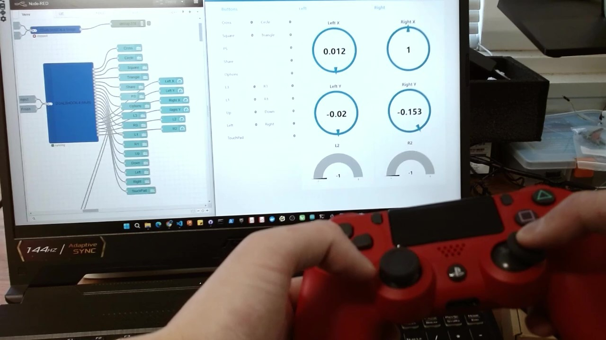

# node-red-contrib-python-dualshock4
Node for communicating with DUALSHOCK4 in Node-RED

## Overview

This is a Node-RED node for communicating with DUALSHOCK 4.

Here is the movie. Click and start playing.

This node has some of the same mechanisms as the python-venv node.  
<https://github.com/404background/node-red-contrib-python-venv>

This node creates a Python virtual environment, installs packages, and executes Python code.  
Therefore, **Python must be installed** in advance.

This node uses the pygame package.  
<https://github.com/pygame/pygame>

## Nodes

Both nodes start processing when they receive input and exit when `msg.kill` is true.  
You can also set the cycle for getting the controller's value.

### DUALSHOCK 4 Single

This node has only one output.

This node outputs only the input of the controller selected at this node.

### DUALSHOCK 4 Multi

This node outputs the controller's input values through 22 output pins.

Hover the mouse to see the type of input.

## Other Links

Communicate with DUALSHOCK 4 in Python (Node-RED):  
<https://404background.com/program/python-dualshock-4/>
